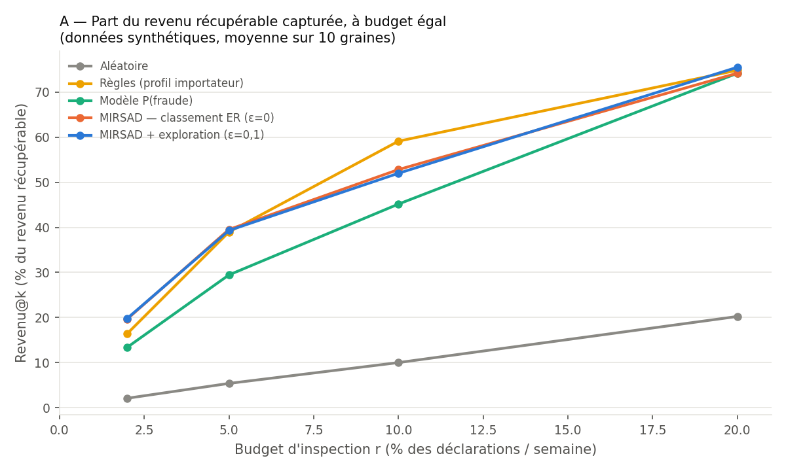
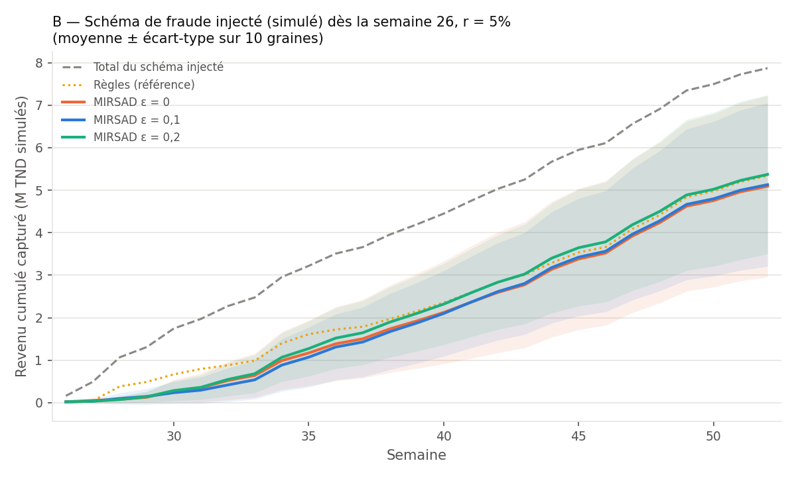

# MIRSAD مرصاد : copilote IA de ciblage douanier

> Hackathon National IA & Finances Publiques (Ministère des Finances, END, ENF, Esprit), 26 septembre 2026.
> Défi principal **T2 : Ciblage et orientation automatisés des contrôles** (Axe 1). Défi secondaire **T18 : Classification et codification automatisées (SH)** (Axe 2).
> **Prototype : données synthétiques et scénario de fraude simulé.** Aucun résultat ne porte sur des déclarations réelles.

## Le problème
Les services des douanes ne peuvent contrôler qu'une petite part des déclarations. Il faut donc décider **quelles
déclarations inspecter**, **pourquoi**, et **combien de dinars sont en jeu**, puis préparer vite un dossier
d'enquête solide pour l'agent.

## Ce que fait MIRSAD
1. **Score** chaque déclaration : probabilité de fraude (LightGBM calibré) × revenu attendu si fraude = **montant en jeu**.
2. **Oriente** sous un budget fixé (r % en Rouge, r % en Orange, le reste en Vert), avec une option d'exploration ε pour
   découvrir de nouveaux schémas.
3. **Prouve** l'intérêt par une **simulation sans fuite d'information** : chaque semaine, le modèle n'apprend que des
   déclarations effectivement contrôlées par le passé (étiquettes sélectives).
4. **Enquête** : pour chaque cas rouge, un agent LLM appelle des outils (déclaration, facteurs SHAP, historique, liens
   importateur–déclarant, prix comparables, cas similaires, espèce SH, statistiques miroir, réglementation) et rédige
   un **dossier en français**. Un **validateur** rejette tout identifiant de preuve, nombre ou citation absent des
   sorties d'outils, toute voie différente de celle du scoreur et toute hypothèse sans preuve compatible. Chaîne de
   fournisseurs : **LLM local sur site** (Qwen3 8B via Ollama) → **API OpenAI** en secours → **gabarit déterministe**,
   avec une correction autorisée par fournisseur. **Le LLM ne décide jamais de la voie.**
5. **Carte des fuites** : statistiques miroir UN Comtrade (Tunisie réelle, 2024), un indicateur de priorisation macro.
6. **Espèce (T18)** : recherche BM25 sur le Système harmonisé 2022 → top 3 SH6 (reclassement LLM optionnel) →
   alerte déterministe si l'espèce déclarée est absente du top 3 et moins taxée.

## Architecture
```
 CSV (BACUDA ou données des organisateurs) → adaptateur (config.yaml) → schéma canonique + schema_report
   → variables (passé uniquement) → modèle P(fraude), R̂ → montant en jeu = P × R̂
   → politique (budget r, exploration ε) → Rouge / Orange / Vert → simulateur (étiquettes sélectives + schéma injecté)
   → cas rouges → agent (function calling, ≤ 8 étapes, température 0) → dossier JSON strict
   → validateur (preuves, nombres, citations verbatim, voie, cohérence hypothèse/preuve)
      [LLM local Qwen3 8B (Ollama) → échec : API OpenAI → échec : gabarit déterministe]
   → application Streamlit (français, entièrement précalculée)
 Module miroir UN Comtrade → « Carte des fuites »
```

## Lancer le projet
```bash
pip install -r requirements.txt
cd scripts
python 00_download.py          # télécharge et vérifie le jeu BACUDA
python 01_build_features.py    # variables (passé uniquement) + scénario injecté + contrôle de cohérence
python 02_simulate.py          # grille de simulation (≈ 7 min sur 16 cœurs) + graphiques A/B + semaine de démo
python 03_mirror.py            # UN Comtrade (réseau requis ; sinon « données miroir indisponibles »)
python make_espece_demo.py     # jeu de démonstration espèce
python 04_espece_eval.py       # évaluation T18
python 05_build_dossiers.py    # dossiers d'enquête : LLM local → API → gabarit déterministe
python 06_export_results.py    # tableau de résultats
python smoke_test.py           # vérifie le chemin de démonstration (< 2 min)
cd .. && python -m pytest -q tests
streamlit run app/Accueil.py
```
**LLM local (recommandé, par défaut)** : installer [Ollama](https://ollama.com), puis :
```bash
ollama pull qwen3:8b
ollama create mirsad-qwen3:8b -f ollama/Modelfile
```
Sur un GPU de 8 Go, lancer le serveur avec `OLLAMA_FLASH_ATTENTION=1` et `OLLAMA_KV_CACHE_TYPE=q8_0`. Mesuré sur une
RTX 4060 Laptop : avec un contexte de 8k, tout tient en VRAM (lecture du prompt 1 744 jetons/s, génération 36 jetons/s) ;
dès 12k, le cache déborde en mémoire partagée (209 jetons/s). Les enquêtes restent donc sous ~7,5k jetons (sorties
d'outils compactes et garde-fou de contexte dans `agent/loop.py`).
**Secours API (optionnel)** : copier `.env.example` en `.env` et y mettre `OPENAI_API_KEYS` (une ou plusieurs clés).
`COMTRADE_KEY` (optionnel) donne le miroir au niveau SH4. Sans LLM ni clé, tout fonctionne en mode déterministe.
Textes juridiques : déposer des `.txt`/`.md` dans `data/legal/`, chacun commençant par `SOURCE: <url ou titre>`.
Données des organisateurs : les placer dans `data/organisers/`, adapter `columns:` dans `config.yaml` ;
`schema_report` indique alors quels modules peuvent tourner.

## Résultats (données synthétiques, à budget égal, 10 graines)
Source : `results/results_table.md` (généré par `scripts/06_export_results.py` à partir de `results/summary_by_seed.csv`).
« MIRSAD (ε = 0) » est le réglage par défaut, un classement par montant en jeu. Le vocabulaire est défini dans
`docs/facts_for_pitch.md`, § 0.

**À retenir (budget 5 %)** : MIRSAD capture 39,9 % ± 11,1 du revenu récupérable, contre 5,4 % ± 0,8 au hasard (≈ 7×).
Sur les fraudes historiques, 14,3 % contre 10,6 % pour les règles. Les règles restent très robustes sur le schéma
injecté, et le modèle y est bimodal (voir limites).

| Politique | r | Revenu@k (total) | Revenu@k (fraudes historiques) | Schéma injecté capturé (revenu) | Faux-vert (revenu) |
|---|---|---|---|---|---|
| Aléatoire | 2% | 2.1 % ± 0.6 | 2.0 % ± 0.2 | 2.2 % ± 1.4 | 95.6 % ± 0.9 |
| Règles (profil importateur) | 2% | 16.4 % ± 0.6 | 4.7 % ± 0.1 | 28.4 % ± 1.2 | 81.1 % ± 0.6 |
| Variante : probabilité seule | 2% | 11.3 % ± 6.3 | 6.7 % ± 1.7 | 16.0 % ± 14.4 | 79.7 % ± 10.7 |
| MIRSAD (montant en jeu, ε = 0) | 2% | 28.3 % ± 9.9 | 4.8 % ± 1.4 | 52.2 % ± 21.3 | 65.8 % ± 10.9 |
| MIRSAD + exploration (ε = 0,1) | 2% | 18.0 % ± 12.5 | 5.9 % ± 1.4 | 30.3 % ± 26.6 | 76.7 % ± 13.8 |
| MIRSAD + exploration (ε = 0,2) | 2% | 24.1 % ± 9.8 | 5.1 % ± 0.9 | 43.4 % ± 20.6 | 69.5 % ± 11.0 |
| Aléatoire | 5% | 5.4 % ± 0.8 | 5.1 % ± 0.3 | 5.7 % ± 1.6 | 90.0 % ± 1.2 |
| Règles (profil importateur) | 5% | 39.0 % ± 0.6 | 10.6 % ± 0.2 | 67.8 % ± 1.3 | 53.9 % ± 0.6 |
| Variante : probabilité seule | 5% | 30.7 % ± 13.1 | 16.7 % ± 2.7 | 45.0 % ± 29.3 | 59.0 % ± 13.1 |
| MIRSAD (montant en jeu, ε = 0) | 5% | 39.9 % ± 11.1 | 14.3 % ± 2.3 | 66.0 % ± 24.6 | 51.2 % ± 11.1 |
| MIRSAD + exploration (ε = 0,1) | 5% | 34.1 % ± 13.8 | 14.8 % ± 2.5 | 53.8 % ± 30.4 | 56.5 % ± 13.8 |
| MIRSAD + exploration (ε = 0,2) | 5% | 38.3 % ± 8.6 | 13.2 % ± 1.5 | 63.8 % ± 18.7 | 52.4 % ± 8.5 |
| Aléatoire | 10% | 10.0 % ± 1.2 | 10.0 % ± 0.5 | 10.0 % ± 2.1 | 79.8 % ± 1.0 |
| Règles (profil importateur) | 10% | 59.1 % ± 0.0 | 23.4 % ± 0.1 | 95.5 % ± 0.0 | 26.6 % ± 0.1 |
| Variante : probabilité seule | 10% | 49.3 % ± 6.4 | 33.9 % ± 1.1 | 64.9 % ± 13.8 | 33.3 % ± 6.5 |
| MIRSAD (montant en jeu, ε = 0) | 10% | 50.1 % ± 9.2 | 32.7 % ± 2.4 | 67.8 % ± 20.9 | 34.3 % ± 8.3 |
| MIRSAD + exploration (ε = 0,1) | 10% | 53.1 % ± 6.6 | 30.7 % ± 1.7 | 75.9 % ± 14.9 | 31.3 % ± 6.2 |
| MIRSAD + exploration (ε = 0,2) | 10% | 55.2 % ± 4.0 | 28.7 % ± 1.4 | 82.2 % ± 9.0 | 28.3 % ± 2.9 |
| Aléatoire | 20% | 20.2 % ± 1.0 | 19.9 % ± 0.6 | 20.6 % ± 1.6 | 60.3 % ± 1.4 |
| Règles (profil importateur) | 20% | 74.8 % ± 0.1 | 50.1 % ± 0.1 | 100.0 % ± 0.0 | 14.3 % ± 0.1 |
| Variante : probabilité seule | 20% | 73.1 % ± 1.9 | 63.2 % ± 0.7 | 83.1 % ± 4.3 | 9.6 % ± 0.8 |
| MIRSAD (montant en jeu, ε = 0) | 20% | 75.1 % ± 1.7 | 62.3 % ± 0.8 | 88.2 % ± 3.7 | 10.7 % ± 0.8 |
| MIRSAD + exploration (ε = 0,1) | 20% | 74.7 % ± 1.8 | 60.7 % ± 0.7 | 88.9 % ± 4.2 | 9.9 % ± 1.2 |
| MIRSAD + exploration (ε = 0,2) | 20% | 73.8 % ± 2.6 | 58.2 % ± 1.0 | 89.6 % ± 5.9 | 9.9 % ± 1.2 |




**Espèce (T18)**, jeu de démonstration de 50 descriptions construit par l'équipe (optimiste) :
BM25 seul : top-1 SH6 56 %, top-3 90 %, alertes 67 % / 55 % (précision / rappel).
Avec le reclassement API : top-1 98 %, top-3 100 %, alertes 100 % / 64 %.
Tentatives d'injection détectées : 3/3 (`results/espece_metrics_*.json`).

## Limites (à lire)
- **Données synthétiques** (BACUDA) : pays, importateurs et bureaux anonymisés, montants non réalistes et devise inconnue
  (affichés « TND simulés »). Tous les gains sont **relatifs** à des références (aléatoire, règles) **à budget égal**.
- **Scénario de fraude injecté** par l'équipe (`src/mirsad/drift.py`, `results/drift_log.json`). Un seul ajustement
  (part 15 % → 5 %), fait avant tout résultat et documenté dans `docs/decisions.md`.
- **Exploration** : aucune différence de moyenne significative (test de Welch, 10 graines). Elle améliore le pire cas
  sur le schéma injecté à 5–10 % de budget (voir `docs/facts_for_pitch.md`, § 5).
- **Espèce** : jeu de 50 descriptions construit par l'équipe, glossaire FR→EN rédigé par la même équipe (évaluation
  optimiste) ; taux de droits **illustratifs**.
- **Miroir** : indicateur de priorisation, pas une preuve (régimes suspensifs, entreprises totalement exportatrices,
  décalages temporels, transit, CIF/FOB, classement).
- **Agent LLM** : le modèle local (8B) est plus lent (plusieurs minutes par dossier sur un GPU portable) et moins fin
  que l'API. Le validateur garantit l'ancrage (preuves, nombres, citations), pas la finesse du raisonnement. Chaque
  dossier indique le fournisseur utilisé (local, API ou gabarit).
- **Base légale** : trois textes publics chargés (extraits). Le Code des douanes n'est présent que pour ses articles
  43 à 64 : la version intégrale accessible (WIPO Lex / Africa-laws) a un encodage de police défectueux, et nous ne
  « réparons » pas un texte juridique. MIRSAD ne génère jamais d'article de loi : toute citation est vérifiée mot pour mot.

## Recommandations pour une mise en production
- **Souveraineté des données** : c'est déjà le mode par défaut du prototype. Le LLM open-weight (Qwen3 8B, licence
  Apache 2.0) tourne **sur site** via Ollama, et l'API externe n'est qu'un secours désactivable (`config.yaml` →
  `llm.api.enabled: false`). En production : API désactivée, serveur GPU interne, dans le respect de la loi organique
  n° 2004-63 sur la protection des données personnelles et sous le contrôle de l'INPDP.
- **Humain dans la boucle** : l'agent des douanes décide ; ses décisions (« fraude confirmée » / « conforme ») alimentent
  les profils de risque et le réentraînement.
- **Suivi de dérive** : taux de fraude par voie, part de faux-verts mesurée par contrôles aléatoires de référence,
  alertes sur les nouveaux importateurs.
- **Intégration** : couche complémentaire à côté du système de sélectivité existant (la Douane a annoncé en mai 2026
  l'intégration d'un module d'apprentissage automatique dans le système national de sélectivité : Directinfo,
  Tuniscope, Réalités), sans le remplacer.

## Sources, bibliothèques et API
**Données**
- Jeu de déclarations synthétiques **BACUDA / Seondong « Customs-Fraud-Detection »** (Institute for Basic Science,
  projet BACUDA de l'OMD), licence **MIT** : https://github.com/Seondong/Customs-Fraud-Detection
  (fichier `data/synthetic-imports-declarations.csv`, commit `0314b92d`).
- **UN Comtrade** (Nations unies), via le package officiel **`comtradeapicall`** : https://comtradeplus.un.org/ ;
  https://pypi.org/project/comtradeapicall/
- **Système harmonisé 2022** : dépôt `datasets/harmonized-system` (licence **ODC-PDDL-1.0**, source UN Comtrade) :
  https://github.com/datasets/harmonized-system
- Jeu de démonstration « espèce » (`data/espece/demo_set.csv`) et description du cas d'injection : **construits par
  l'équipe** ; ils ne décrivent aucune expédition réelle.

**Travaux qui ont inspiré l'approche** (idées uniquement, code non réutilisé)
- S. Kim et al., « DATE: Dual Attentive Tree-aware Embedding for Customs Fraud Detection », KDD 2020.
- Travaux d'apprentissage actif / exploration pour le ciblage douanier sur le même dépôt BACUDA (stratégies de
  requête hybrides exploitation / exploration), voir le dossier `query_strategies` et `literatures` du dépôt Seondong.

**Textes juridiques** (`data/legal/`, extraits verbatim, chaque fichier commence par sa ligne `SOURCE:`)
- OMC, Accord sur la mise en œuvre de l'article VII du GATT de 1994 (évaluation en douane), texte français :
  https://www.wto.org/french/docs_f/legal_f/20-val_01_f.htm (le site précise que les textes reproduits n'ont pas le
  statut juridique des originaux).
- OMD, Convention de Kyoto révisée, Annexe générale, chapitre 6 « Contrôle douanier » :
  https://www.wcoomd.org/fr/topics/facilitation/instrument-and-tools/conventions/pf_revised_kyoto_conv/kyoto_new/gach6.aspx
- Code des douanes tunisien (loi n° 2008-34 du 2 juin 2008), articles 43 à 64, extrait publié par la base DCAF
  « La législation du secteur de la sécurité en Tunisie » : https://legislation-securite.tn/
  (aucun système d'information de l'administration tunisienne n'a été interrogé).

**Modèles et API**
- **LLM local (par défaut)** : Qwen3 8B (Alibaba Qwen, licence Apache 2.0, quantification Q4_K_M) servi par **Ollama**
  (https://ollama.com), variante `mirsad-qwen3:8b` avec un contexte de 8k (`ollama/Modelfile`).
- **Secours** : OpenAI API (Chat Completions, function calling, structured outputs) : `gpt-4.1` pour l'agent,
  `gpt-4.1-mini` pour le reclassement SH. Clés lues depuis `.env` (non versionné).

**Bibliothèques Python**
pandas, numpy, scikit-learn (IsolationForest, IsotonicRegression, métriques), LightGBM, SHAP, networkx, rank_bm25,
Streamlit, Plotly, matplotlib, openai (client aussi utilisé pour l'API compatible d'Ollama), comtradeapicall, pyarrow,
PyYAML, joblib, scipy (test de Welch), pypdf (extraction du texte juridique), pytest.

**Annonce publique citée** : intégration d'un module d'apprentissage automatique dans le système national de
sélectivité, annoncée par la Douane tunisienne en mai 2026 (Directinfo, Tuniscope, Réalités).

---
## English summary
MIRSAD is a customs-targeting copilot built overnight for the Tunisian national hackathon on AI & public finance. It
scores each import declaration (calibrated LightGBM P(fraud) × expected recovered revenue) and assigns red / orange /
green lanes under a fixed inspection budget. Its value is measured in a **leakage-free weekly simulation with
selective labels**: only inspected declarations ever reveal their outcome, and an injected new fraud scheme starts at
week 26. For each red case, a tool-calling LLM agent gathers evidence and writes a French case file. A validator
rejects any evidence id, number or legal quote that is not in the tool outputs, and any change of lane; on failure the
system tries the next provider: a local open-weight LLM (Qwen3 8B via Ollama) first, then the OpenAI API, then a
deterministic template. A UN Comtrade mirror-statistics module (real Tunisia 2024 data) and an
HS-classification check (T18) complete the prototype. All results are on synthetic data and relative to baselines at
equal budget.

